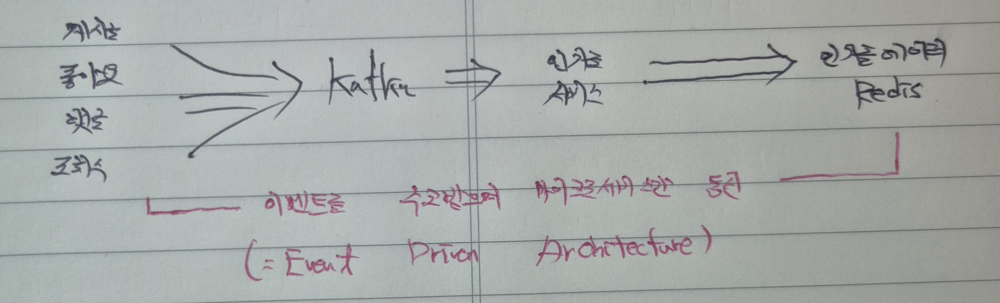

## 1.  개요
> Study
- 본 프로젝트는 MSA Project 설계 및 구현 등에 대한 공부 내용을 담고 있으며, 실전에 바로 투입할 수 있을 정도의 깊이로 학습한 내용을 반영한다.
> Basic Structure
- 향후 개인 혹은 팀 프로젝트 설계 시 MSA / Monolithic 등 프로젝트 구조(유형) 상관없이 본 프로젝트를 최대한 활용할 수 있을 것에 염두를 둔다. 

## 2. Proejct Configuration - "Basic"

> 독립적인 마이크로서비스의 구동을 위해 빌드(settings.gradle) 등 모든 설정은 별도로 진행
- 각 MicroServices Modules들은 kuke-board라는 root project 최상위 Module에 속하는 하위 Modules이다.
- Module에 대한 gradle 설정은 따로 진행하며, 상위 모듈에서 include하여 이를 반영하는 구조이다.
- java와 test 역시 각 Module 내에서 따로 구성해주도록 한다.
- 각 Module의 독립적인 실행을 보장하기 위해 SpringBootApplication(실행파일)을 각 Module 별로 따로 구성한다.
- MicroServices의 실행 포트는 모두 다르며, Event 혹은 Message를 통해 유기적인 상호작용을 한다.

## 3. Project Design - "BRD"

> 게시글을 작성하기 위한 테이블을 설계하며 대용량 트래픽 상황을 가정하여 게시글을 N개의 샤드로 샤딩하는 환경을 가정
- Primary Key = Article Id.
- 동일 카테고리에 속한 게시글들이 방대해질 경우 이를 샤딩하는 상황을 가정하며, 샤딩의 효율성을 고려함에 따라 Shard Key = Board Id.
- 샤딩기법은 편의상 Hash-Based Sharding으로 가정한다.

## 4. Proejct Design - "PK"

> PK채번을 위해 분산환경에서 순차성과 고유성을 보장할 수 있는 채번 알고리즘을 활용한다.
- X에서 제공하는 Snowflake 알고리즘을 사용하여 위 요구사항을 만족할 수 있도록 PK채번을 진행한다.
- Snowflake을 활용한 채번은 공통활용모듈로 Common 도메인 책임 하에 둔다.

## 5. Project Design - "DTO Seperation"

> CQRS와는 별도로 요청 유형 및 목적에 따라 명확한 DTO 구분을 위해 Request/Response 객체 분리를 진행한다.
- Create Request / Update Request / Response 등 트래픽 증가에 따라 프로젝트 복잡도가 높아지고 유지보수에 비용이 많이 들 것으로 예상할 경우, 정확한 프로젝트 관리 등을 목적으로 목적에 따른 DTO 분리를 진행한다.
- 프로젝트 규모가 클 수록 하나의 DTO로 모든 데이터 요청/응답에 대응하는 것이 어렵다.
- 요청책임을 세분화하여 관리할 수 있으며, Swagger 등 문서화 관리에도 유리하다.

## 6. Project Design - "REST API Seperation"

> 본 프로젝트의 API 설계 시 모든 API 요청을 단순 GetMapping/PostMapping 일원화가 아닌, 요청 목적 및 특징 등에 따라 PutMapping을 사용하는 API 세분화가 이루어질 수 있도록 구성
- 멱등성 유지 구분(Post : 생성/멱등성 보장 못함, Put : 수정/멱등성 보장 가능)
- URL 등 요청자원 설계 시 Post : 컬렉션(객체 자체), Put : 특정 자원(id)

## 7. Product Design - "Pagination"

> 서버의 과부하를 줄이고 성능적으로 유리한 데이터 읽기를 위해 페이징 쿼리를 활용 

[case 1) Paging]
 
- N번(=offset) 페이지에서 M개(=limit) 게시글을 불러온다.
- 총 게시글 수에 따른 총 페이지 개수를 나타낸다.

- Index를 활용하여 데이터 추출 및 페이징 성능 향상
  - [ASIS] 전체 데이터 개수가 매우 많아 row query에서 데이터 추출 시 3~4초 소요(*full scan/file sort)
  - [TOBE] Secondary Index / Clustered Index를 활용 및 적절한 전략 수립을 통해 유의미한 조회성능향상
  - [Paging Query & Index 정리](https://velog.io/@gyrbs22/%EB%B0%B1%EC%97%94%EB%93%9C-%EC%9D%B8%EB%8D%B1%EC%8A%A4%EB%A5%BC-%EB%AA%85%ED%99%95%ED%9E%88-%ED%8C%8C%EC%95%85%ED%95%98%EA%B8%B0-%EC%A1%B0%ED%9A%8C%EC%84%B1%EB%8A%A5%ED%96%A5%EC%83%81%EC%9D%B4-%EC%96%B4%EB%8A%90-%EB%B6%80%EB%B6%84%EC%97%90%EC%84%9C-%EC%9D%B4%EB%A3%A8%EC%96%B4%EC%A7%80%EB%8A%94%EA%B0%80%EB%8B%A8%EC%88%9C-%EC%9D%B8%EB%8D%B1%EC%8A%A4-%ED%99%9C%EC%9A%A9%EB%B6%80%ED%84%B0-Covering-Index-%EB%93%B1%EC%9D%98-%EC%A0%84%EB%9E%B5%EA%B9%8C%EC%A7%80)
  - 페이징 쿼리를 사용할 경우 Boot에서 제공하는 Pagable보다 JPA의 natvie query로 직접 작정하는 것이 효과적

[case 2) Infinite Scroll]

- 별도 offset 구성없이 이전에 조회한 마지막 페이지 혹은 기준점을 기억하여 다음 스크롤 시 데이터를 추출하도록 한다.
- 다음 스크롤에 나타날 데이터의 기준 혹은 추출 조건을 기억하고 Clustered Index에서 바로 데이터를 추출한다.

- Index를 활용하여 데이터 추출 및 페이징 성능 향상
  - [ASIS] offset을 찾기 위한 scan 작업과 Clustered/Secondary Index 작업을 통해 불필요한 조회비용이 발생하고, 복잡한 페이징 쿼리 작업이 필요하다.
  - [TOBE] 명확한 기준점을 매개변수로 전달하며 Clustered Index를 활용 등을 통해 조회성능향상하고 offset 관계없이 균등한 조회성능을 확보
  - 최초 무한스크롤 조회 쿼리와 이후(기준점 기억 이후) 조회 쿼리를 다르게 구성한다.

## 8. Function #1 - "comments"

> 댓글을 작성한다.
- 댓글 조회/생성/삭제 API를 구축한다.
- 댓글목록 조회 시 계층형(대댓글)으로 조회하며 오래된 순으로 각 계층별 최소 2depth부터 무한depth까지 조회한다.
- 하위 댓글이 모두 삭제되어야 상위 댓글을 삭제할 수 있으며, 하나라도 하위 댓글이 있다면 "삭제표시"만 표기된다.
- 계층형 depth에 따라 2depth = Adjaceny list(인접리스트) & 무한depth = Path enumeration(경로열거)를 사용한다.

## 9. Function #2 - "Like"

> 게시글 별 사용자는 좋아요를 표시한다.
 
[기능적 요구사항 및 설계]
- 사용자는 각각의 게시글 당 1개의 좋아요를 표시하거나 취소할 수 있다.
- 게시글 ID와 사용자 ID를 활용하여 "좋아요 테이블"을 별도 구성한다.
- 좋아요 수는 게시글 별 좋아요 생성 및 삭제 시점에 즉시 갱신
- 좋아요 테이블에서 파생 데이터(derived)를 관리하기 위한 비정규화(별도의 좋아요 수 추출)를 진행
  (*중복 집계가 발생하지 않는 상황이므로 비정규화에 어색함이 없음)

[좋아요 기능의 동시성 문제]
- [격리수준에 따른 동시성 문제 발생](https://velog.io/@gyrbs22/%EB%B0%B1%EC%97%94%EB%93%9C-MSA-%EB%B0%8F-%EB%B6%84%EC%82%B0DB-%ED%99%98%EA%B2%BD%EC%97%90%EC%84%9C-%EC%9D%98%EB%8F%84%EC%A0%81%EC%9D%B8-%ED%85%8C%EC%9D%B4%EB%B8%94-%EB%B9%84%EC%A0%95%EA%B7%9C%ED%99%94%EB%A5%BC-%ED%86%B5%ED%95%B4-%ED%8A%B8%EB%9E%9C%EC%9E%AD%EC%85%98%EC%9D%98-%EC%84%B1%EB%8A%A5%EC%9D%84-%EB%B3%B4%EC%99%84%ED%95%A0-%EC%88%98-%EC%9E%88%EB%8A%94-%EB%B0%A9%EC%95%88%EB%8F%99%EC%8B%9C%EC%84%B1-%EB%AC%B8%EC%A0%9C%EA%B0%80-%EB%B0%9C%EC%83%9D%ED%95%98%EB%8A%94-%EC%83%81%ED%99%A9%EC%9D%84-%EA%B3%A0%EB%A0%A4%ED%95%98%EB%A9%B4%EC%84%9C)
- 데이터 일관성을 보장하기 위해 적절한 형태의 어떠한 형태의 Lock을 활용할 지 고민 필요(트랜잭션 특성상 조회에 대한 lock은 현실적으로 불가능하므로 )
- 해당 도메인의 트래픽이나 로직의 복잡도를 고려할 때 비관적 락으로도 충분히 동시성 문제 해결 가능(update 처리 시 DB row data를 그 시점에서 조회하면서 lock을 명시하는 방안)
- 현재 프로젝트에서는 모든 락 구현 방안에 대해 살펴보도록 한다.

## 10. Function #3 - "board(article)/comment count"

> 게시글 수와 댓글 수를 조회한다.
- 향후 인기글 선정을 위해 필요한 기능
- 좋아요 수와 마찬가지로 비정규화하여 별도의 테이블을 생성 및 관리한다.

## 11. Function #4 - "Abusing"

> 사용자는 게시글 1개 당 10분에 1번 조회수를 집계한다.
- 10분 동안 조회를 아무리 많이 하여도 1번의 조회로 집계한다.
- Redis를 활용하여 트래픽이 많은 조회수 처리를 진행하며, 데이터 개수에 따른 RDB로의 데이터 백업을 진행한다.
- 게시글 및 사용자 별 조회수 1증가이므로, article_id + user_id = key이다.
- 여러 시스템 혹은 데이터베이스가 있는 체계(시스템)에서, 이와 같은 조회수어뷰징 방지나 연산의 원자성을 확보하기 위해 락(key/TTL)을 획득하기 위한 과정을 분산락(Distributed Lock)이라 한다. 

## 12. Function #5 - "Backup"

> 조회수 100단위로 데이터를 조회수 RDB에 백업하여 저장한다.
- 많은 트래픽을 비교적 빠른 시간에 처리해야 하며, 데이터 일관성의 중요도가 떨어지므로 디스크 접근 비용을 감소하기위한 Redis를 사용하여 처리한다.
- 프로젝트의 구현은 Redis Cluster을 통해 고가용성을 확보한 것으로 가정, 실제 환경은 Docker를 활용하여 단일 Redis 구축한다.
- 백업은 개수단위백업을 진행하며, 데이터의 MySQL(Master DB) 백업으로 저장하는 방식을 활용한다(백업시점에서의 집계데이터는 향후 인기글에서도 적용 가능)

## 13. Kafka 

> 댓글/좋아요/조회 처리에 대한 이벤트를 정의하고 발행하여 kafka에서 처리할 수 있도록 구성한다.
- 각각의 서비스 요청에 대해 메시지 발행 후 Kafka Broker에 전송하도록 한다.
- 도메인 별 topic을 지정하고 적절한 Consumer Group 지정을 통해 이를 구독하여 메시지(데이터) 처리가 이루어지도록 한다.
- 대용량 데이터의 순차처리와 병렬처리 등 고가용성 및 확장성을 확보하기 위한 조치이며, 분산환경에서 대규모 데이터 처리를 위한 방안이다.

## 14. Hot articles

> 인기글을 선정한다.
- 하루동안 생성한 모든 게시글에 대해 좋아요/댓글/조회 수 기반으로 인기글을 선정한다.
- 일단위로 매일 오전 1시에 10건의 인기글을 선정하여 업데이트 한다.
- 최근 7일의 인기글 조회가 가능하다.

[대규모 트래픽 및 데이터의 안정적인 처리를 위해 스트리밍 기반 처리 진행]
- 인기글 선정에 필요한 이벤트를 스트림으로 받아 실시간으로 인기글 집계 처리한다.
- 데이터 변경사항에 대한 스트림데이터(게시글/댓글/좋아요/조회수)를 생산하여 실시간으로 인기글을 집계한다.

[인기글 데이터는 일정 시간 이후 폐기하는 휘발성을 가지므로 Redis를 활용하여 저장]
- 인기글 데이터는 Redis에 저장하여, Sorted Set(zset) 자료구조를 활용하여 정렬 데이터를 관리한다.
- 각 당일에 Client가 필요한 데이터(이전 00시부터 익일 00시까지 집계한 상위 10개의 인기글)를 Sorted Set 자료구조에 보관한다.
- Client에게 보여줄 일자를 key로 설정하며, 이러한 인기글 내역들은 7일간 보관 후 폐기한다.

[스트리밍 기반 처리를 진행하기 위해 Kafka 시스템을 구축하여 집계]
- 각 4개의 서비스에서 실시간/대용량으로 요청하는 데이터를 안전하게 처리하기 위한 Message Broker 시스템을 구축한다.
- 구현은 복잡하지만 안정적이며, 높은 활용도를 가지기에 고가용성 및 확장성에 유리하다.

[인기글이 필요한 데이터는 자체적으로 생산해야 하는 책임을 가진다.]
- 인기글 서비스가 본인에게 필요한 데이터를 실시간으로 다른 서비스에 요청하거나 생산을 위임하지 않고, 자체적으로 생산하고 보관하는 책임을 가진다.
- 다른 서비스에 의존하지 않고 점수계산에 필요한 데이터를 Redis에 데이터를 보관하도록 한다.
- 이 보관한 데이터는 인기글 산정에 필요한 데이터로 하루가 지나면 폐기한다.

[Outbox Pattern을 활용하여 분산 트랜잭션의 원자성과 데이터 일관성을 확보한다.]
- 비즈니스 로직과 이벤트 메시지 전송을 단일 트랜잭션으로 구성한다.
- 데이터 일관성 확보를 위한 Outbox Pattern 및 Message Relay를 구성하여 미전송/전송실패 이벤트 메시지를 처리한다.
- Redis를 활용하여 application 실행 시 Message Relay를 통한 outbox polling 및 이벤트 메시지 처리 책임을 분산하여 맡는다.

## 15. CQRS - 게시글 조회 최적화

> 게시글 단건 조회/게시글 목록 조회/캐시 최적화를 통한 조회 기능을 최적화한다.
- 게시글 기능 특성 상 트래픽적으로 쓰기보다 읽기가 훨씬 많이 발생하여 기능적 비균형이 발생한다.
- 게시글 조회 서비스의 서비스 분리와 자체적인 데이터베이스 구축을 통해 서비스를 최적화한다.
- 최신글을 많이 조회하는 상황을 가정하여, In Memory DB(Redis)를 사용한 조회성능 개선을 기대한다.
- 만료 혹은 데이터 유실 상황에서는 Command 서버로 간헐적인 데이터 요청을 통해 원본을 복원 및 생성한다.
- Redis 캐싱을 도입하여 Redis 부하를 분산하고 조회 서비스를 기능적 최적화한다.

## 16. 이외 알아두면 좋은 개발지식들

[Entity/DTO의 객체생성도 목적에 따라 명확히 구분하여 표기한다.]

| 메서드명       | 의미         | 주 사용처               | 예시                                |
| ---------- | ---------- | ------------------- | --------------------------------- |
| **from**   | 다른 객체에서 변환 | Entity→DTO, DTO→DTO | `ArticleReadResponse.from(model)` |
| **of**     | 값 세트로 구성   | DTO나 VO             | `Money.of(1000)`                  |
| **create** | 새로운 개념의 생성 | Entity, Aggregate   | `Order.create(orderer, items)`    |
